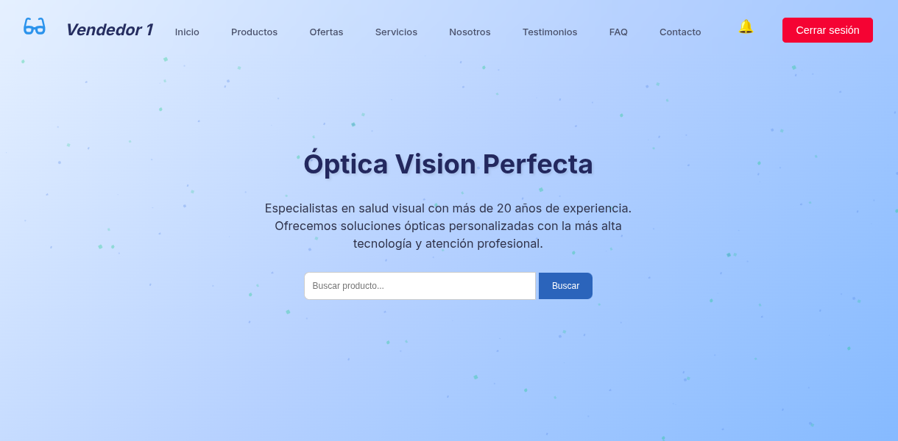
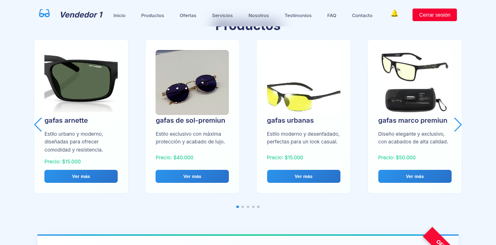

# 🕶️ Óptica Vision - FullStack Laravel & JS

Óptica Vision es una aplicación web moderna diseñada para la gestión, exhibición y venta de productos ópticos. Permite la administración de productos, el manejo de ofertas especiales, la generación automatizada de recibos de compra en formato PDF y exportaciones a Excel. Además, cuenta con un sistema robusto de roles de usuario (Administrador, Vendedor y Cliente) con notificaciones en tiempo real sobre el estado de las compras.

---

## 🛠️ Requisitos e Instalación

### 1. Clonar el repositorio (Común para Windows y Linux)
```bash
git clone https://github.com/Esteban-Lucas-Hernandez/OpticaVision-FullStack-Laravel-JS.git
cd OpticaVision-FullStack-Laravel-JS
```

---

### 🐧 Opción A: Instalación en Linux (Ubuntu/Debian)

#### A.1. Instalar dependencias del sistema y PHP
Asegúrate de actualizar los repositorios de paquetes del sistema e instalar Composer junto con las extensiones de PHP necesarias para el proyecto:
```bash
sudo apt update
sudo apt install composer -y
sudo apt update && sudo apt install php8.4-xml php8.4-gd php-sqlite3 -y
```

#### A.2. Instalar dependencias del proyecto (Laravel)
Instala las dependencias definidas en el archivo `composer.json`:
```bash
composer install
```

#### A.3. Configurar variables de entorno y clave de aplicación
Crea tu archivo `.env` a partir del ejemplo y genera la clave única de encriptación:
```bash
cp .env.example .env
php artisan key:generate
```

#### A.4. Preparar la Base de Datos (SQLite)
Crea la base de datos de SQLite, limpia la caché de Laravel y ejecuta las migraciones junto con los seeders iniciales:
```bash
touch database/database.sqlite
php artisan config:clear
php artisan cache:clear
php artisan migrate --seed
```

---

### 🪟 Opción B: Instalación en Windows

> [!NOTE]
> Se recomienda contar con **PHP 8.2+**, **Composer** y **Node.js** instalados en el sistema. Puedes usar herramientas como **Laravel Herd** o **Laragon** para facilitar la gestión del entorno en Windows. Asegúrate de tener habilitadas las extensiones `fileinfo`, `gd`, `sqlite3` y `xml` en tu archivo `php.ini`.

#### B.1. Instalar dependencias de PHP (Laravel)
Abre tu terminal (PowerShell o CMD) en la raíz del proyecto y ejecuta:
```bash
composer install
```

#### B.2. Configurar variables de entorno y clave de aplicación
* **En CMD (Símbolo del sistema):**
  ```cmd
  copy .env.example .env
  php artisan key:generate
  ```
* **En PowerShell:**
  ```powershell
  Copy-Item .env.example -Destination .env
  php artisan key:generate
  ```

#### B.3. Preparar la Base de Datos (SQLite)
* **En CMD (Símbolo del sistema):**
  ```cmd
  type nul > database\database.sqlite
  php artisan config:clear
  php artisan cache:clear
  php artisan migrate --seed
  ```
* **En PowerShell:**
  ```powershell
  New-Item database\database.sqlite -ItemType File -Force
  php artisan config:clear
  php artisan cache:clear
  php artisan migrate --seed
  ```

---

### 🚀 Levantar los servidores locales (Común)

Para ejecutar el proyecto, debes levantar los servidores de PHP y Node.js en paralelo (ya sea en Windows o en Linux):

* **Terminal 1 (Servidor Backend de Laravel):**
  ```bash
  php artisan serve
  ```
  *(El proyecto estará disponible en `http://localhost:8000`)*

* **Terminal 2 (Compilador de Assets Vite/Frontend):**
  ```bash
  npm install
  npm run dev
  ```

---

## 📁 Estructura del Proyecto

El proyecto sigue una estructura limpia basada en el patrón de arquitectura de capas y separación de responsabilidades:

```text
OpticaVision-FullStack-Laravel-JS/
├── app/                              # Lógica principal de la aplicación en PHP
│   ├── Exports/                      # Clases de exportación (ej. a hojas de cálculo de Excel)
│   ├── Http/                         # Capa de control de flujo HTTP
│   │   ├── Controllers/              # Controladores que reciben peticiones y ejecutan lógica
│   │   │   ├── Admin/                # Controladores específicos de la administración
│   │   │   ├── Client/               # Controladores específicos de clientes
│   │   │   ├── Seller/               # Controladores específicos de vendedores
│   │   │   ├── Controller.php        # Controlador base de Laravel
│   │   │   ├── BaseController.php    # Base común con respuestas estandarizadas
│   │   │   ├── ProductController.php # Lógica pública e interna de productos y catálogo
│   │   │   └── PurchaseController.php# Lógica del flujo de compras, generación de PDFs e historial
│   │   └── Middleware/               # Middlewares de seguridad (filtrado por roles, auth, etc.)
│   ├── Models/                       # Modelos Eloquent ORM que representan las tablas de la BD
│   │   ├── Product.php               # Modelo de Producto
│   │   ├── ProductImage.php          # Modelo de Imágenes de Productos (soporta URLs externas y locales)
│   │   ├── Purchase.php              # Modelo de Órdenes de Compra y transacciones
│   │   └── User.php                  # Modelo de Usuario con roles (admin, vendedor, cliente)
│   └── Services/                     # Servicios especializados con lógica de negocio aislada
├── config/                           # Archivos de configuración del Framework
├── database/                         # Migraciones, factories y bases de datos locales
│   ├── migrations/                   # Archivos de esquema de tablas SQL
│   ├── seeders/                      # Poblamiento inicial de datos (usuarios e imágenes)
│   └── database.sqlite               # Base de datosSQLite en desarrollo
├── public/                           # Assets estáticos accesibles directamente por el navegador
├── resources/                        # Archivos fuente del frontend
│   ├── css/                          # Archivos de estilos (TailwindCSS)
│   ├── js/                           # JavaScript de interacción dinámica
│   └── views/                        # Vistas Blade estructuradas por módulos y roles
├── routes/                           # Definición de todas las rutas del sistema
│   ├── web.php                       # Rutas web principales
│   ├── api.php                       # Rutas de endpoints API
│   └── auth.php                      # Rutas predefinidas del sistema de autenticación
├── storage/                          # Almacenamiento local (imágenes subidas, recibos PDF de compras)
├── composer.json                     # Archivo de dependencias del ecosistema PHP
└── package.json                      # Archivo de dependencias del ecosistema Node.js
```

---

## 🎨 Características Destacadas
* **Carga Dinámica de Imágenes:** Soporta el renderizado de imágenes almacenadas de manera local en el servidor, así como URLs absolutas de imágenes provenientes de servidores externos (ej. MercadoLibre).
* **Control de Roles Integrado:** Acceso diferenciado por perfiles (Administrador, Vendedor y Cliente).
* **Generación de Reportes:** Exportación de compras en formato Excel y descarga automatizada de recibos en formato PDF.
* **Notificaciones Dinámicas:** Sistema ligero para notificar de inmediato a los compradores cuando sus transacciones han sido aceptadas o rechazadas por un vendedor.

---

## 📸 Capturas de Pantalla

Aquí puedes ver la interfaz del proyecto en funcionamiento:

### Vista de Inicio / Bienvenida


### Carrusel de Productos y Catálogo


